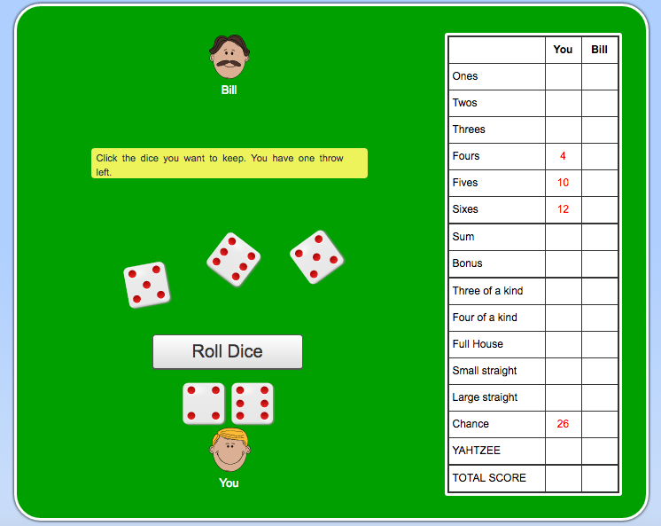

# Yahtzee

### GA WDI London - Project 1

#### 2 Player Yahtzee

Yahtzee is a board game by Hasbro that can be played alone or with multiple players. This game only accommodates two players on the same computer. It was made to be as true to the official game as possible, so it's use is in the automatic counting of the scores.

##### [Play it here!](https://pacific-lake-61896.herokuapp.com/ "Here!")

##### Rules

1. First player starts and has to roll the dice
2. The face of the dice determines the score on the scoreboard
3. The player can click on dice to keep them from being rolled
4. The player only has 3 dice rolls, once they are over they must score, removing that category from the board
5. Repeat for the next player.

Each player has 13 turns each, as they must score after every turn, thus the harder to get categories (Full House etc.) are best picked off early. While this game can be mostly luck, strategy comes into play when considering categories such as Four of a Kind, as they are an accumulated score of the four dice you have.

For more info on the game, you can visit the [official rules page](http://www.yahtzee.org.uk/rules.html yahtzee.org).

#### Approach / How it works

I started this project not knowing what the game was, so the first thing I did was research. After looking at the the rules and watching it being played, I wondered how I could emulate this with code. I then stumbled upon [this](https://cardgames.io/yahtzee/).

An already online version of the game, it gave me the idea for displaying the layout, so most of my front-end inspiration came from this. Playing it also properly taught me how to play the game, and with that I started cracking with creating the entire thing.

Each game has 26 turns, as two players get 13 turns each that must get played out. When the dice is rolled, the scores that are higher than 0 change to green, to indicate that there is value. Once it is clicked, that removes the event listeners on it, and it cannot be clicked on again. The singles are tallied by a loop, that goes through each dice and accumulates the numbers, however the harder special scores such as large straight are hard coded.

This game is all about the on click event listeners, as the dice can also be clicked on to keep them in your "pocket", meaning they wont be rolled so you can go for a big score.

#### The build

* HTML 5, CSS and jQuery were used to create this game.

#### Problems & Challenges

The main challenge I faced building this game, was in managing the click event handlers, and when turn them off and on for both the scoreboard and dice. It was really difficult keeping track of what my code was doing without trying it out in practice. 
